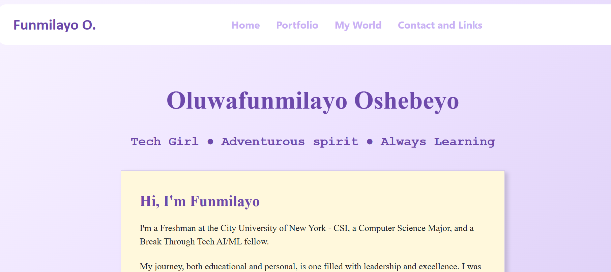

## Hi, I'm Funmilayo, and I made myself a personal website.

Website is live on Github Pages!: https://dee-24r.github.io/FunmilayoOshebeyo/

This is my personal website that I've made myself. My website contains 4 pages:
- a home page (The home :D)
- a portfolio page (Where you can see my skills and achievements)
- a 'My World' page (Where you can learn a bit about me personally)
- a Contact and Links page (With contacts and links)

I'll definitely be making more edits in the near future. This site was made using HTML, CSS, Bootstrap, and a bit of Javascript.

## Credits
### Favicon Credit:
I created and downloaded my favicon from https://favicon.io/favicon-generator/
### Image credit:
The AI image in the portfolio - I created it 2 months ago, by telling AI to create an image that represents me.
The other random pics (like those in the My World page) are random downloads from Google search.

View my website [here](https://dee-24r.github.io/FunmilayoOshebeyo/)